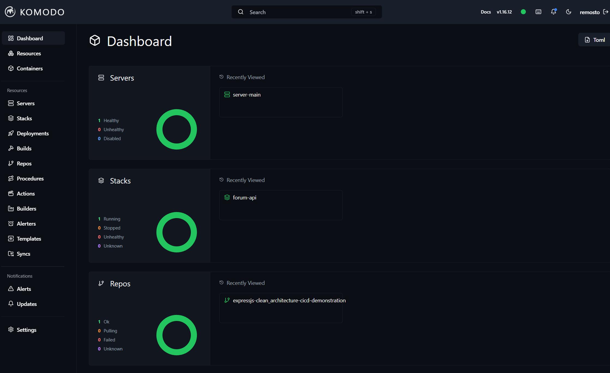
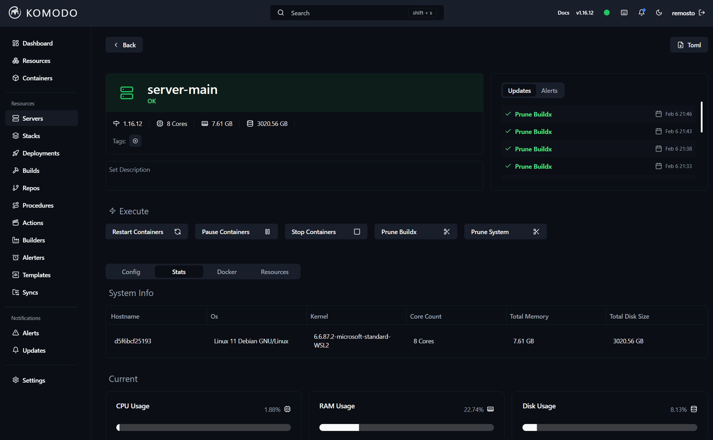
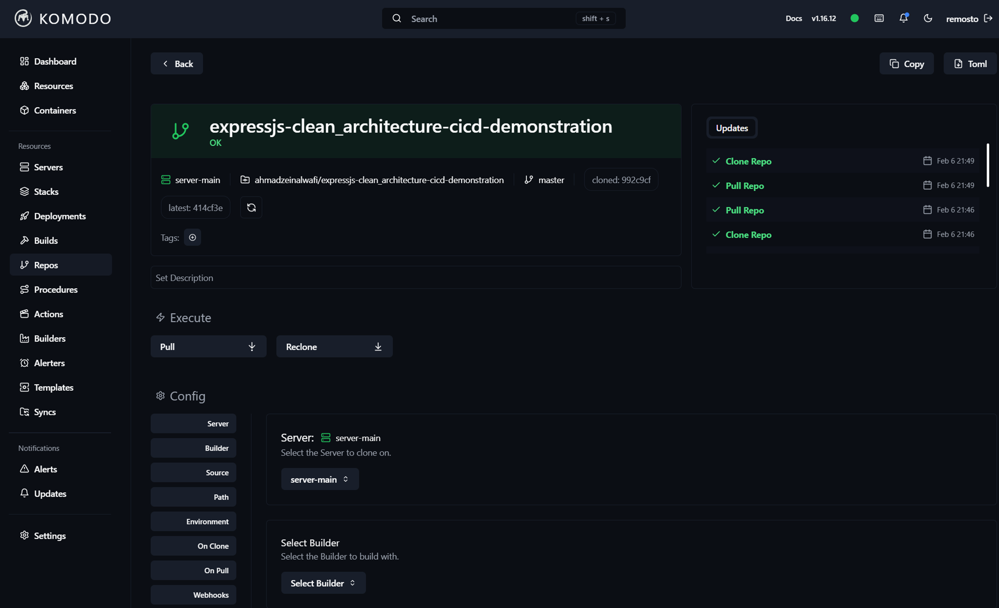
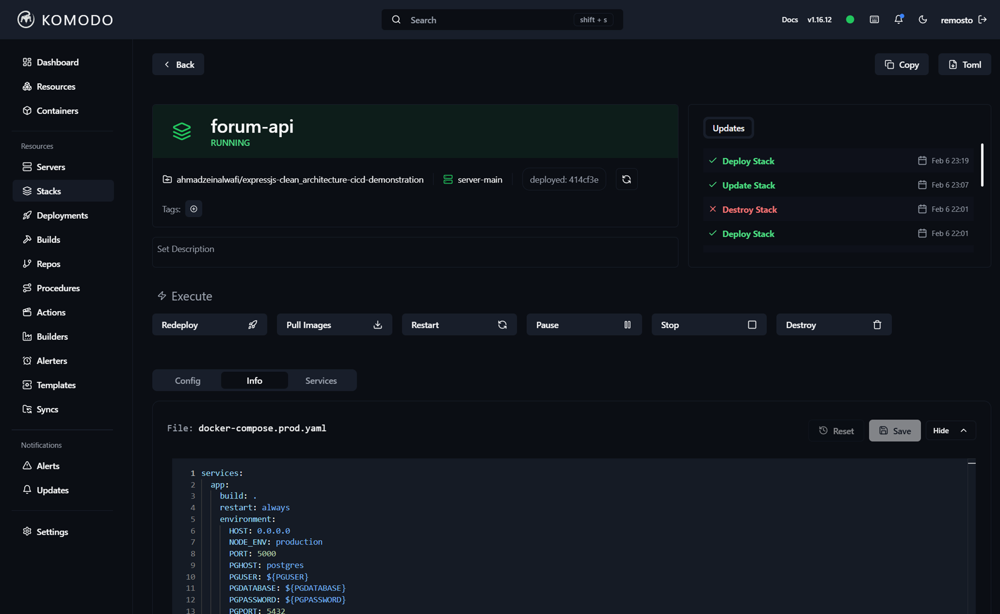
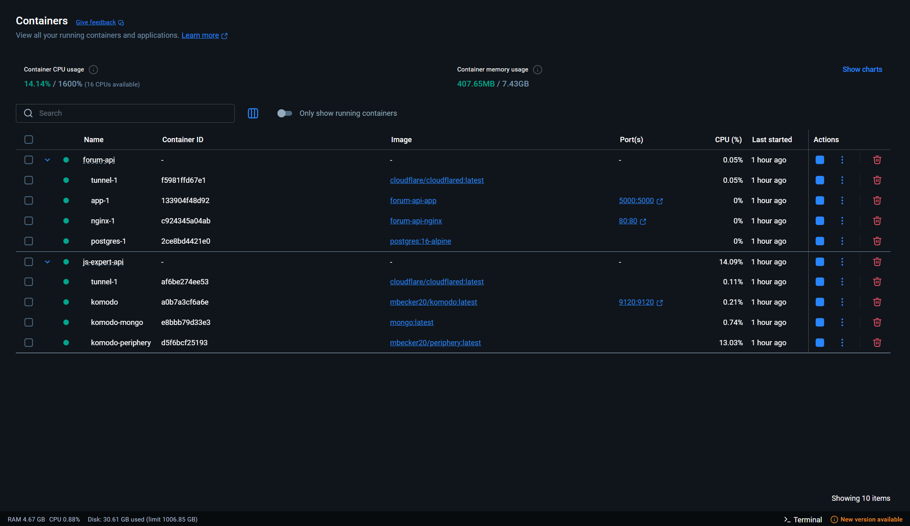
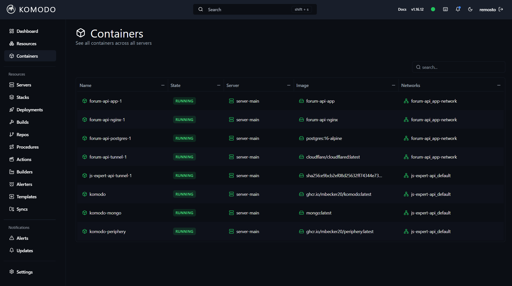
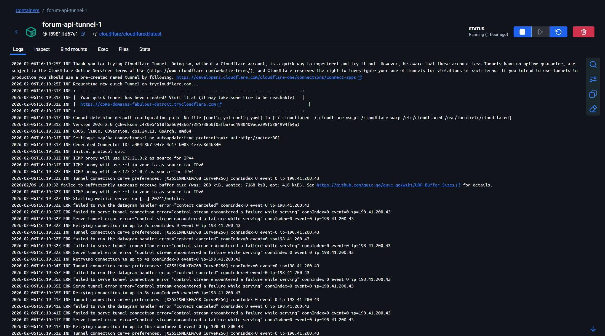
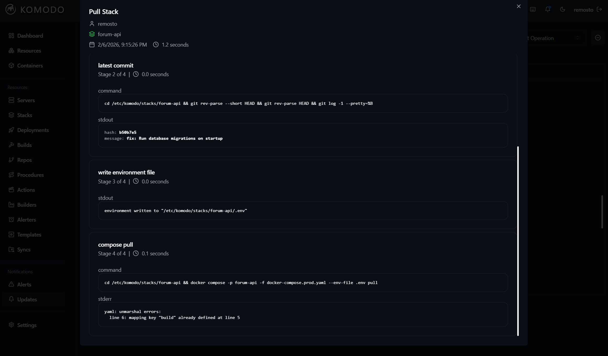

# 🚢 Deployment Architecture & Komo.do Guide

This document provides a deep dive into our deployment stack, which leverages **Docker**, **Komo.do** (for CD and Orchestration), and **Cloudflare Tunnels** (for secure access).

## 🏗️ The Stack Overview

Our production environment runs on a single server (or cluster) managed by **Komo.do**. The application stack is defined in `docker-compose.prod.yaml` and includes:

1.  **App**: Node.js API.
2.  **Postgres**: Database.
3.  **Nginx**: Reverse Proxy.
4.  **Cloudflare Tunnel**: Secure exposure to the internet.

---

## 🦎 Komo.do: The Orchestrator

**[Komo.do](https://komo.do)** is our central command center. It allows us to manage servers, build images, and deploy stacks from a beautiful web interface.

### 1. Dashboard
The dashboard gives a high-level view of our infrastructure health.

### 2. Connected Servers
Komo.do uses a "Periphery" agent installed on our target servers to control them.

### 3. Repositories
We link our GitHub repository directly to Komo.do. This allows it to pull the latest `docker-compose.prod.yaml` and build contexts.

---

## 🚀 Deployment Workflow

### 1. Defining the Stack
We define our application as a **Stack** in Komo.do. This corresponds to a Docker Compose project. We inject sensitive environment variables (Secrets) here, keeping them out of the code.

### 2. The Deployment
When code is pushed to `master`:
1.  **GitHub Actions** runs tests.
2.  **GitHub Actions** sends a webhook to Komo.do.
3.  **Komo.do** pulls the repo, builds the images, and updates the stack.

The result is a running Compose project:

### 3. Monitoring Containers
We can inspect individual containers, view logs, and monitor resource usage directly from the UI.

---

## 🔒 Network & Security (Cloudflare Tunnel)

We do **not** open port 80 or 443 on our server firewall. Instead, we use **Cloudflare Tunnel**.

*   The `tunnel` service in our stack creates an outbound connection to Cloudflare's edge network.
*   Public traffic hits `forum.ahmadzeinalwafi.com` (example) -> Cloudflare -> Tunnel Connection -> Nginx -> App.

---

## 🔧 Troubleshooting

### Common Errors
If a deployment fails, meaning looking at the logs is essential. One common issue is failure to pull or build if the repo state is invalid.

**Fix**: Ensure `Prune Buildx` is enabled in the Stack settings implementation to force a fresh build if layers get corrupted.
